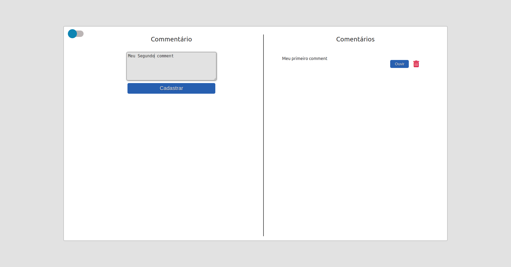
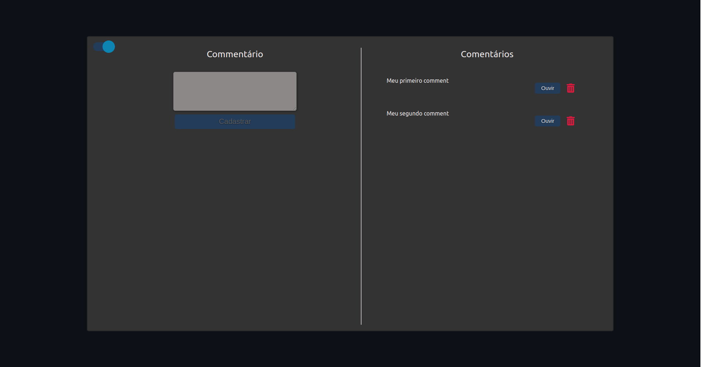

# Smarkio Comment-Reader
Um website que do lado esquerdo você pode postar um comentário, e do lado direito você pode visualizá-lo e ouvi-lo.

## Indice
* [Screenshots](#screenshots)
* [Tecnologias](#tecnologias)
* [Configuração](#configuração)
* [Instalação](#Instalação)
* [FeedBack](#so)

## Screenshots





<br>Link da pasta das imagens <a href="https://github.com/Rods27/smarkio-page/tree/main/client/public">aqui.</a>


## Tecnologias
<ul>
  <li><a href="https://nodejs.org/en/">Node.js</a></li>
  <li><a href="https://www.mysql.com/">MySQL</a></li>
  <li><a href="https://www.ibm.com/br-pt/cloud/watson-text-to-speech">IBM Watson - Text to Speech</a></li>
  <li><a href="https://reactjs.org">React</a></li>
  <li><a href="https://sass-lang.com/">Sass</a></li>
</ul>

## Instalação
1. Assim que tiver clonado o repositório, usando o terminal do [vscode](https://code.visualstudio.com/) ou o terminal do seu sistema operacional, abra-o na pasta server.
- Installe as dependencias usando :
```
npm install;
```
Execute o mesmo comando na pasta client.

Certifique-se que tem instalado o [Node](#indice) e o [MySql](#indice).

## Configuração
#### Criando o Database
- Assim que tiver tudo instalado, installe e abra o [MySQLWorkBench](https://www.mysql.com/products/workbench/), entre no seu servidor local, abra uma nova query e digite: 
```
CREATE DATABASE IF NOT EXISTS Smarkio_DB;
```
depois:
```
CREATE DATABASE IF NOT EXISTS Smarkio_DB;

CREATE TABLE Smarkio_DB.commentaries (
	id INT unsigned NOT NULL auto_increment,
    comment varchar(200) NOT NULL,
    CONSTRAINT pk_commentaries PRIMARY KEY (id)
);
```

## Funcionalidades


## Feedback 

Ficarei bem agradecido caso queira me dar um feedback costrutivo, caso queira meus contatos estarão abaixo!

Email: rods.leite27@gmail.com e <a href="https://linkedin.com/in/rodrigoleite27">Linkedin</a>.

